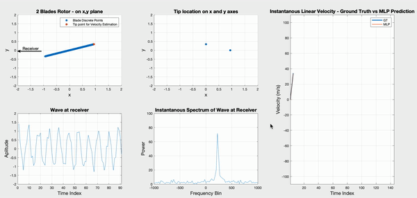

# Physics Informed MLP for Linear Velocity Estimation via Doppler Effect

This repository presents a simulation of a Doppler effect caused by a two-blade propeller with a linear speed of 100m/s. The circular movement of the propeller causes the frequency change on an emitted waveform from a transmitter placed on the direction of 'Receiver' in the GIF above.
